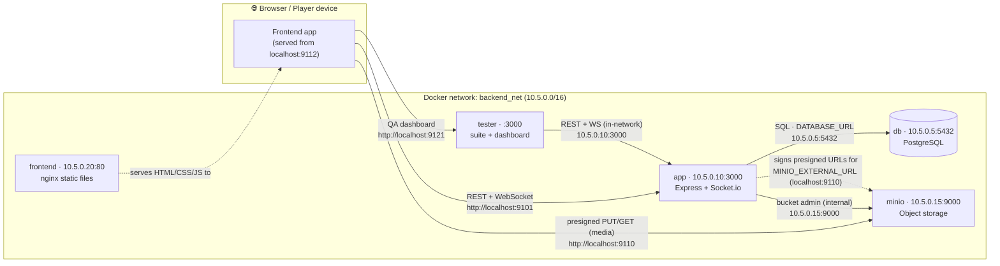

# Scavenger

An interactive, **real-time, location-based scavenger-hunt game**. A Manager
authors a game (quests, routes, media), players join a room and are split into
teams, and as each team physically reaches GPS waypoints they unlock quests,
submit answers/photos/videos, and get validated — live, over WebSockets. It
ships with a backend API, an object store for media, and an isolated testing
environment (automated suite + a manual "God Mode" QA dashboard).

- **Backend** — Node.js (ES modules) · Express · Socket.io · Prisma · PostgreSQL · MinIO (S3-compatible).
- **Media** — uploaded straight from the client to MinIO via presigned URLs; PostgreSQL stores only the reference.
- **Testing** — a separate container with an automated test suite and a 3-column QA dashboard.

---

## Repository structure

```
Scavenger/
├── docker-compose.yml      # db + minio + app + tester services (one network)
├── .env_expample           # copy to .env and fill in
├── scavenger/              # ── BACKEND APP ──
│   ├── Dockerfile
│   ├── prisma/
│   │   ├── schema.prisma    # data model (Game, Quest, Track, Team, Submission, …)
│   │   └── seed.js          # demo data + printed IDs
│   ├── src/
│   │   ├── index.js         # Express + Socket.io bootstrap
│   │   ├── prisma.js        # Prisma client singleton
│   │   ├── minio.js         # internal (admin) + external (presign) MinIO clients
│   │   ├── sockets/         # Socket.io handlers (geofence, team channels)
│   │   ├── routes/          # Express routers
│   │   ├── controllers/     # request handlers
│   │   └── utils/           # haversine, current-waypoint helpers
│   ├── docs/               # 📖 backend documentation (start at docs/README.md)
│   └── README.md
└── tester/                 # ── TESTING ENVIRONMENT ──
    ├── test-runner.js       # automated suite
    ├── dashboard.html       # manual "God Mode" QA dashboard
    ├── assets/              # drop test media here (git-ignored)
    └── README.md
```

📖 **Backend documentation lives in [`scavenger/docs/`](scavenger/docs/README.md)** — API reference, WebSocket events, the MinIO↔Postgres media flow, and a frontend integration guide.

---

## Docker services & how they connect

Everything runs on one Docker network (`backend_net`, subnet `10.5.0.0/16`).

| Service  | Image                | Host → Container ports        | Internal IP  | Role |
|----------|----------------------|-------------------------------|--------------|------|
| `db`     | `postgres:15-alpine` | — (internal only)             | `10.5.0.5`   | PostgreSQL database |
| `app`    | built `./scavenger`  | **9101** → 3000               | `10.5.0.10`  | REST API + Socket.io |
| `frontend` | built `./frontend` (nginx) | **9112** → 80         | `10.5.0.20`  | Player / manager / staff UI |
| `minio`  | `minio/minio`        | **9110** → 9000 (API), **9111** → 9001 (console) | `10.5.0.15` | Object storage for media |
| `tester` | built `./tester`     | **9121** → 3000               | (dynamic)    | Automated suite + QA dashboard |



### The two MinIO addresses (important)
MinIO is reached two different ways, on purpose:

- **Internal** (`MINIO_INTERNAL_ENDPOINT` = `10.5.0.15:9000`) — used **only** by the backend for in-network admin (ensuring the bucket exists).
- **External** (`MINIO_EXTERNAL_URL` = `http://localhost:9110`) — every URL handed to a client (browser/player), including **presigned upload/download URLs**, is signed against this host so the signature matches the address the client actually hits.

See [`scavenger/docs/media-and-minio.md`](scavenger/docs/media-and-minio.md) for the full media flow.

---

## Deploying the manager behind a single Cloudflare tunnel

The manager UI is **same-origin**: its nginx reverse-proxies `/api`, `/socket.io`
(WebSocket) and `/scavenger` (MinIO media) to the in-network services, so one
hostname serves the app, its data, sockets and images over HTTPS — no CORS, no
mixed content, no second tunnel.

1. Point one Cloudflare hostname at the **manager** container (`:9113` → nginx `:80`) at the **root** path.
2. In `.env`, set `MINIO_URL=https://YOUR_HOST` (so media URLs resolve through the proxy). `BACKEND_URL` only affects the QA dashboard.
3. Rebuild the manager and recreate `app`: `docker compose up -d --build manager app`.
4. In the Cloudflare dashboard: **turn OFF Rocket Loader** (Speed → Optimization) — it rewrites the JS bundle and causes a blank page; ensure **WebSockets** are ON (Network); SSL/TLS **Full**; then **purge cache**.

> A white page over Cloudflare while direct-IP works is almost always **Rocket
> Loader** (or another JS-optimization feature) mangling the module bundle.

---

## Quick start

```bash
cp .env_expample .env        # fill in POSTGRES_* and MINIO_USER / MINIO_PASSWORD
docker compose up --build
```

Then:

| What | URL |
|------|-----|
| Frontend (player / manager / staff) | http://localhost:9112 |
| REST API + WebSocket | http://localhost:9101 (`GET /health` to check) |
| MinIO console | http://localhost:9111 |
| QA dashboard (God Mode) | http://localhost:9121 |

Seed a demo game (users, quests, a track, a room) and print the IDs:

```bash
docker compose exec app npm run seed
```

Run the automated backend test suite:

```bash
docker compose run --rm tester npm test
```

---

## Documentation

- **Backend docs:** [`scavenger/docs/README.md`](scavenger/docs/README.md)
  - [Architecture](scavenger/docs/README.md#architecture) · [API reference](scavenger/docs/api-reference.md) · [WebSocket events](scavenger/docs/websocket-events.md) · [Media & MinIO](scavenger/docs/media-and-minio.md) · [Frontend guide](scavenger/docs/frontend-guide.md)
- **Testing environment:** [`tester/README.md`](tester/README.md)

## Key design notes

- **No auth layer** (foundational build): endpoints take `userId` / `teamId` explicitly.
- **Anti-cheat reveal:** coordinates are exposed before quest content; content only after geofence + challenge validation.
- **Race-safe validation:** approvals use atomic conditional updates so points are never double-awarded.
- **Team-wide sync:** unlocking/approving broadcasts to the whole team over Socket.io.
