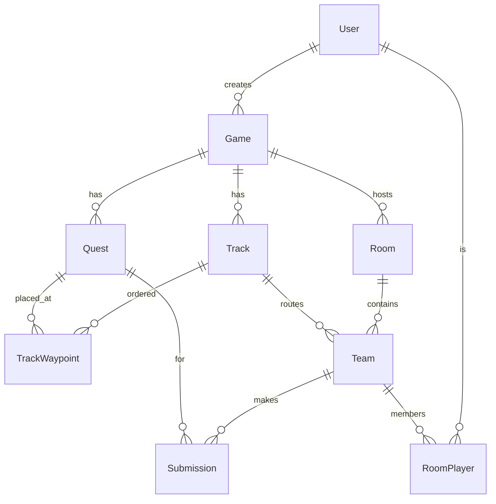

# Backend documentation

Documentation for the **Scavenger backend** — a Node.js (ES modules) + Express +
Socket.io + Prisma + MinIO service for a real-time, location-based quest game.

## Contents

| Doc | What's inside |
|-----|---------------|
| [architecture](#architecture) (this page) | Layers, data model, how REST and WebSockets connect |
| [api-reference.md](api-reference.md) | Every REST endpoint: method, path, body, response |
| [websocket-events.md](websocket-events.md) | Socket.io channels and every event payload |
| [media-and-minio.md](media-and-minio.md) | **Uploading & retrieving images/video** (MinIO ↔ Postgres) — frontend recipes |
| [frontend-guide.md](frontend-guide.md) | End-to-end integration: full game lifecycle, recovery, sync |

> New to the media flow? Jump straight to **[media-and-minio.md](media-and-minio.md)** —
> it explains that images live in **MinIO** while Postgres stores only the **URL reference**,
> with copy-paste `fetch` examples.

---

## Architecture

### Runtime & layers

```
HTTP / WebSocket
      │
      ▼
 src/index.js ──────────────► creates Express app + http server,
   │  attaches Socket.io, stores io on the app (app.set("io", io))
   │
   ├── src/routes/*.js  ──►  src/controllers/*.js   (request handlers)
   │                              │
   │                              ├── src/prisma.js   (PrismaClient singleton → PostgreSQL)
   │                              ├── src/minio.js     (MinIO clients → presigned URLs)
   │                              └── src/utils/*.js   (haversine, getCurrentWaypoint)
   │
   └── src/sockets/index.js  ──►  Socket.io handlers (join_room, geofence)
```

- **Routes → Controllers.** Each `src/routes/<area>.js` is a thin Express router that maps paths to a controller function in `src/controllers/<area>Controller.js`.
- **Prisma.** `src/prisma.js` exports one shared `PrismaClient`. All DB access goes through it.
- **MinIO.** `src/minio.js` exports two clients — an **internal** one for in-network admin (bucket ensure) and an **external** one that signs presigned URLs against the browser-reachable host. See [media-and-minio.md](media-and-minio.md).
- **Sockets.** `src/sockets/index.js` registers connection handlers. The Express `io` instance is shared with controllers via `app.set("io", io)` / `req.app.get("io")`, so REST handlers (e.g. `rooms/start`, `staff validate`) can emit real-time events.
- **Utils.** `haversine.js` (great-circle distance for geofencing) and `team.js` (`getCurrentWaypoint(teamId)` → the team's current waypoint + quest).

### Startup

`npm start` runs `prisma generate` → `prisma db push` (sync schema to the DB) → `node src/index.js`. On boot the app ensures the MinIO bucket exists, then listens on `PORT` (3000 in Docker, mapped to host 9101).

### Data model (Prisma)

Defined in [`../prisma/schema.prisma`](../prisma/schema.prisma).



| Model | Purpose |
|-------|---------|
| `User` | A person (`role`: MANAGER / STAFF / FOLLOWER). No password — identity is passed explicitly. |
| `Game` | Authored game with `introduction` / `conclusion` JSON blocks. |
| `Quest` | A challenge: `content` (JSON description) + `postChallengeContent` (JSON reward), `openChallengeType` (NONE/PASSWORD/QR = **entry**), `challengeType` (QUIZ/PHOTO/VIDEO = **approval**), `score`. |
| `Track` | A route (ordered list of waypoints). One team plays one track. |
| `TrackWaypoint` | Places a `Quest` on a `Track` at `sequenceOrder` + `latitude`/`longitude`/`radius`. Same quest can sit on multiple tracks at **different coordinates**. |
| `Room` | A live session of a game; `status` OPEN/PLAYING/FINISHED; optional `staffPassword`. |
| `Team` | A team in a room, bound to a track. Tracks `totalScore`, `currentSeqNum` (progress), `activeQuestId` (the one quest open at a time). |
| `RoomPlayer` | Membership join of a `User` to a `Team`. |
| `Submission` | A team's answer/media for a quest; `content` = **the MinIO URL** or quiz text; `status` PENDING/APPROVED/REJECTED. |

### Key behaviors

- **Identity:** no auth; endpoints accept `userId` / `teamId` in the body or query.
- **Anti-cheat reveal:** `GET /api/play/next-coordinate` exposes only coordinates + entry type; the quest `content` is revealed only by `POST /api/play/unlock-quest` after the QR/password check.
- **One active quest per team** with atomic claim (`activeQuestId`), broadcast to the whole team.
- **Quiz auto-grade vs staff approval:** `QUIZ` challenges grade instantly against an answer key in `content`; `PHOTO`/`VIDEO` go to staff.
- **Race-safe validation:** approvals use atomic conditional updates so points are awarded at most once.

Full request/response details are in [api-reference.md](api-reference.md); the realtime side in [websocket-events.md](websocket-events.md).
