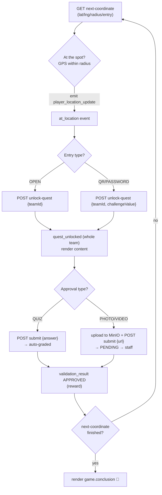

# Frontend integration guide

How to drive the whole game from a frontend, end to end. Pairs with the
[API reference](api-reference.md), [WebSocket events](websocket-events.md), and
[Media & MinIO](media-and-minio.md).

```js
const API = "http://localhost:9101";
const api = (method, path, body) =>
  fetch(API + path, {
    method,
    headers: body ? { "Content-Type": "application/json" } : undefined,
    body: body ? JSON.stringify(body) : undefined,
  }).then(async r => ({ status: r.status, body: await r.json().catch(() => null) }));
```

There is **no login**. You pass `userId` / `teamId` around explicitly — capture
them from the responses when you create/join, and keep them in your app state.

---

## The three roles

| Role | Does | Screens usually needed |
|------|------|------------------------|
| **Manager** | authors the game, opens a room, starts play | setup wizard, cheat-sheet |
| **Player (FOLLOWER)** | joins a team, walks to waypoints, unlocks & submits | map/GPS, quest, upload, reward |
| **Staff** | reviews photo/video submissions, swaps players | live feed, approve/reject |

---

## 1. Manager: build & open a game

```js
const { body: manager } = await api("POST", "/api/users", { username: "gm", role: "MANAGER" });
const { body: game } = await api("POST", "/api/games", {
  title: "City Hunt", creatorId: manager.id,
  introduction: { text: "Welcome!" }, conclusion: { text: "The End 🎉" },
});

// One track per team you want. Each track = one team's route.
const trackA = (await api("POST", "/api/tracks", { gameId: game.id, name: "Team A" })).body;
const trackB = (await api("POST", "/api/tracks", { gameId: game.id, name: "Team B" })).body;

// Quests (see api-reference for the content/challenge fields)
const quest = (await api("POST", "/api/quests", {
  gameId: game.id, title: "Fountain", score: 10,
  openChallengeType: "QR", openChallengeValue: "QR-ABC",
  challengeType: "PHOTO",
  content: { description: "Photograph the fountain" },
  postChallengeContent: { reward: "Built in 1901" },
})).body;

// Place the quest on each track — DIFFERENT coordinates per track routes teams apart.
await api("POST", `/api/tracks/${trackA.id}/waypoints`, { waypoints: [
  { questId: quest.id, sequenceOrder: 1, latitude: 40.4168, longitude: -3.7038, radius: 20 }]});
await api("POST", `/api/tracks/${trackB.id}/waypoints`, { waypoints: [
  { questId: quest.id, sequenceOrder: 1, latitude: 40.4200, longitude: -3.7100, radius: 20 }]});

// Open a room → auto-creates one team per track.
const room = (await api("POST", "/api/rooms", { gameId: game.id, staffPassword: "s3cret" })).body;
// room.teams = [{ id, name, trackId }, ...]
```

## 2. Lobby: players & staff join

```js
// Round-robin: each join lands the player on the currently-smallest team.
const p1 = (await api("POST", `/api/rooms/${room.id}/join-player`, { username: "bob" })).body;
// p1.user.id, p1.team.id  ← keep these

await api("POST", `/api/rooms/${room.id}/join-staff`, { username: "carol", staffPassword: "s3cret" });

// Live roster (poll this to render who's on which team):
const roster = (await api("GET", `/api/rooms/${room.id}`)).body;
```

## 3. Connect sockets & start

```js
import { io } from "socket.io-client";
const socket = io(API, { transports: ["websocket"] });
socket.on("connect", () => socket.emit("join_room", {
  roomId: room.id, teamId: p1.team.id, isStaff: false,
}));
socket.on("game_started", () => enableGameplay());

await api("POST", `/api/rooms/${room.id}/start`);   // manager action → emits game_started
```

---

## The game loop

For each waypoint the team repeats: **locate → unlock → submit → validate → reward → advance**.



### Locate
```js
const nc = (await api("GET", `/api/play/next-coordinate?teamId=${teamId}`)).body;
// { latitude, longitude, radius, sequenceOrder, openChallengeType }  — NO quest content yet (anti-cheat)
// or { finished: true }

// Stream the player's position; the backend geofences it:
socket.emit("player_location_update", { userId, teamId, lat, lng });
socket.on("at_location", () => showUnlockButton());   // inside the radius
```

### Unlock (reveals content, for the whole team)
```js
// OPEN entry: no challengeValue. QR/PASSWORD: pass the scanned/typed value.
const r = await api("POST", "/api/play/unlock-quest", { teamId, challengeValue });
if (r.status === 200) showQuest(r.body.content);      // 403 = wrong value
```
Every teammate also receives `quest_unlocked` with the same `content` — so
switching devices/among teammates shows the quest already open (see
[team-wide sync](#team-wide-sync)).

### Submit
- **QUIZ (automated):**
  ```js
  const r = await api("POST", "/api/play/submit", { teamId, content: "42" });
  // r.body.result === "CORRECT" → an auto validation_result APPROVED arrives (bypasses staff)
  // "INCORRECT" → try again (infinite attempts, no partial state saved)
  ```
- **PHOTO/VIDEO (staff):** upload the file to MinIO, then submit the URL — see
  **[Media & MinIO](media-and-minio.md)**. The submission is `PENDING` and staff
  get a `submission_pending` event.

### Validate & reward
```js
socket.on("validation_result", (p) => {
  if (p.status === "APPROVED") {
    showReward(p.postChallengeContent);   // render text/media reward
    advance();                            // loop → next quest
  } else {
    showRetry(p.message);                 // stays on the same quest
  }
});
```

### Staff side
```js
// Live feed:
socket.on("submission_pending", (s) => addCard(s));   // s.content = MinIO URL → render it
// or poll: GET /api/staff/submissions?roomId=...

await api("POST", `/api/staff/submissions/${submissionId}/validate`,
          { status: "APPROVED", validatorId: staffUserId });  // or "REJECTED"
```

### The conclusion
After an approval, check `next-coordinate`; when it returns `{ finished: true }`,
render the game's ending:
```js
const nc = (await api("GET", `/api/play/next-coordinate?teamId=${teamId}`)).body;
if (nc.finished) showConclusion(game.conclusion);     // the game.conclusion JSON block
```

---

## Refresh & recovery

If the player reloads, rebuild the screen from the server:
```js
const s = (await api("GET", `/api/play/current-state?userId=${userId}`)).body;
// s.team, s.currentSeqNum, s.activeQuestId, s.pendingSubmissions
// If activeQuestId is set → the quest is open; re-call unlock-quest {teamId} to fetch its content again.
// pendingSubmissions[].content → media already submitted (render it).
```
Quizzes intentionally keep **no partial state** — a reload restarts the quiz from
the beginning.

---

## Team-wide sync

State is **per team**, not per device. Because `quest_unlocked`,
`submission_pending`, and `validation_result` all carry `teamId`, a client that
joins its `team:<teamId>` channel stays in lockstep with teammates:

- One member unlocks → **all** members get `quest_unlocked` (same `content`).
- One member uploads a photo → it's the team's submission; teammates can see it via `current-state.pendingSubmissions` or the staff feed.
- Staff approves → **all** members get `validation_result` with the reward, then advance together.

Only **one quest is active per team at a time**; a second unlock of a different
quest is rejected (`409`), and re-unlocking the active one is idempotent.

---

## Concurrency & safety

- **No double points.** Staff approvals use atomic conditional updates: if two
  staff approve the same (or a duplicate) submission simultaneously, exactly one
  wins (`200`) and the other gets `409` — the score rises once.
- **Anti-cheat reveal.** `next-coordinate` never returns quest `content`; only
  `unlock-quest` does, and only after the QR/password check.
- **Idempotent unlock.** Safe to call `unlock-quest` again for the active quest
  (returns `alreadyActive: true`) — handy on reconnect.

---

## Checklist for a minimal player client

1. Join → keep `userId`, `teamId`.
2. `io(...)` and `emit("join_room", { roomId, teamId })`.
3. Loop: `next-coordinate` → stream `player_location_update` → on `at_location`, `unlock-quest`.
4. Render `content`; submit (quiz text, or MinIO upload for photo/video).
5. On `validation_result` APPROVED → show reward, then back to step 3.
6. When `next-coordinate` is `finished` → show `game.conclusion`.
7. On reload → `current-state` to restore.
