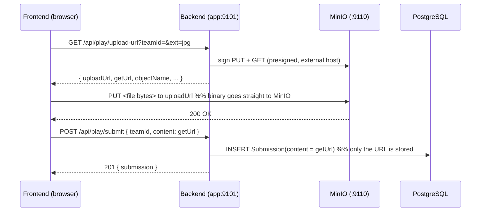

# Media & MinIO — uploading and retrieving images/video

This is the guide for a **frontend developer** who needs to attach a photo or
video to a quest submission and later display it.

## The one thing to understand first

> **Images and videos are stored in MinIO, not in PostgreSQL.**
> PostgreSQL stores only a **URL reference** to the object.

- **MinIO** is an S3-compatible object store. The binary file (the actual JPEG/MP4) lives here, in a bucket called `scavenger`.
- **PostgreSQL** (the `Submission.content` column) stores a **string** — the URL that points at that MinIO object. When you "get an image", you read that URL from the API and load it from MinIO.

The file **never passes through the Node backend**. The browser uploads it
straight to MinIO using a short-lived **presigned URL** the backend hands out.
This keeps large uploads off the API server.



---

## Uploading a photo/video (3 steps)

### Step 1 — ask the backend for a presigned URL

```
GET /api/play/upload-url?teamId=<teamId>&ext=jpg
```
Response:
```json
{
  "uploadUrl": "http://localhost:9110/scavenger/<teamId>/<uuid>.jpg?X-Amz-...",
  "getUrl":    "http://localhost:9110/scavenger/<teamId>/<uuid>.jpg?X-Amz-...",
  "objectName": "<teamId>/<uuid>.jpg",
  "bucket": "scavenger",
  "method": "PUT",
  "expiresIn": 600
}
```
- `uploadUrl` — where you **PUT** the file bytes.
- `getUrl` — a presigned **GET** URL to read the object back (for rendering).
- `objectName` — the object's key inside the bucket (keep this if you want fresh URLs later — see [expiry](#-caveat-presigned-urls-expire)).
- Both URLs point at `MINIO_EXTERNAL_URL` (`http://localhost:9110`) so they're reachable from the browser.

### Step 2 — PUT the file straight to MinIO

```js
await fetch(uploadUrl, {
  method: "PUT",
  body: file,                                   // a File/Blob from <input type="file">
  headers: { "Content-Type": file.type || "application/octet-stream" },
});
```

### Step 3 — tell the backend which URL to record

```js
await fetch(`${API}/api/play/submit`, {
  method: "POST",
  headers: { "Content-Type": "application/json" },
  body: JSON.stringify({ teamId, content: getUrl }),   // the URL is what gets stored in Postgres
});
```

### Full copy-paste helper

```js
const API = "http://localhost:9101";

async function uploadAndSubmit(teamId, file) {
  const ext = (file.name.split(".").pop() || "bin").toLowerCase();

  // 1) presigned URLs
  const pre = await fetch(`${API}/api/play/upload-url?teamId=${teamId}&ext=${ext}`)
    .then(r => r.json());

  // 2) PUT the bytes directly to MinIO
  const put = await fetch(pre.uploadUrl, {
    method: "PUT",
    body: file,
    headers: { "Content-Type": file.type || "application/octet-stream" },
  });
  if (!put.ok) throw new Error(`MinIO upload failed: ${put.status}`);

  // 3) record the URL against the team's current quest (status = PENDING)
  const submission = await fetch(`${API}/api/play/submit`, {
    method: "POST",
    headers: { "Content-Type": "application/json" },
    body: JSON.stringify({ teamId, content: pre.getUrl }),
  }).then(r => r.json());

  return { submission, url: pre.getUrl, objectName: pre.objectName };
}
```

For **QUIZ** quests there's no file — just `POST /api/play/submit` with the text
answer as `content` (it's graded instantly). Photo/video submissions become
`PENDING` and appear to staff via the `submission_pending` socket event.

---

## Retrieving / displaying media

The stored `content` **is a URL** — render it directly. You get it from:

- **Staff review:** `GET /api/staff/submissions?roomId=<roomId>` → each item's `content` is the MinIO URL. Or listen for the `submission_pending` socket event (its `content` field).
- **Player recovery:** `GET /api/play/current-state?userId=<userId>` → `pendingSubmissions[].content`.
- **Right after upload:** the `getUrl` you already have.

```js
// Render, guessing the tag from the extension
function renderMedia(url) {
  const clean = url.split("?")[0].toLowerCase();
  if (/\.(png|jpe?g|gif|webp)$/.test(clean)) return ``;
  if (/\.(mp4|webm|mov)$/.test(clean))       return `<video src="${url}" controls></video>`;
  if (/\.(mp3|wav|ogg|m4a)$/.test(clean))    return `<audio src="${url}" controls></audio>`;
  return `<a href="${url}" target="_blank">download</a>`;
}
```

Because the media tags do a plain GET, **no CORS handling is needed** for
rendering. (A browser `PUT` upload does a CORS preflight, which MinIO allows by
default.)

---

## ⚠️ Caveat: presigned URLs expire

The `getUrl` stored in `Submission.content` is presigned and valid for
**`expiresIn` seconds (600 = 10 minutes)**. After that it returns
`AccessDenied` and won't render.

For a short QA/review loop this is fine. For anything longer-lived, prefer one
of these patterns:

1. **Store `objectName`, mint fresh GET URLs on demand.** Persist the stable
   `objectName` (e.g. in your own state or a DB column) and call
   `upload-url` again — or add a small `GET /media?object=<objectName>` endpoint
   that returns a fresh `presignedGetObject` — whenever you need to display it.
2. **Make the bucket public-read** (test environments only) so plain object
   URLs like `http://localhost:9110/scavenger/<objectName>` render without
   signing. Not recommended for real media.

The current backend stores the presigned `getUrl` directly, so treat rendered
media as valid for ~10 minutes after upload unless you adopt pattern (1).

---

## How MinIO is wired (why two hosts)

`src/minio.js` builds **two** clients:

| Client | Endpoint | Used for |
|--------|----------|----------|
| `internalClient` | `MINIO_INTERNAL_ENDPOINT` (`10.5.0.15:9000`) | in-network admin only (ensure the bucket exists) |
| `externalClient` | `MINIO_EXTERNAL_URL` (`http://localhost:9110`) | **signs every presigned URL** handed to a client |

A presigned URL's signature is bound to the host it was signed for, so it must
be signed against the address the **browser** will actually hit
(`localhost:9110`) — not the internal Docker address. A fixed `region` is set so
signing needs no network round-trip. The bucket stays **private**; access is
only via presigned URLs.

> Deploying beyond localhost? Set `MINIO_EXTERNAL_URL` to your public MinIO
> host/domain so presigned URLs point somewhere the client can reach.

See also: [api-reference.md](api-reference.md#gameplay-apiplay) · [frontend-guide.md](frontend-guide.md).
